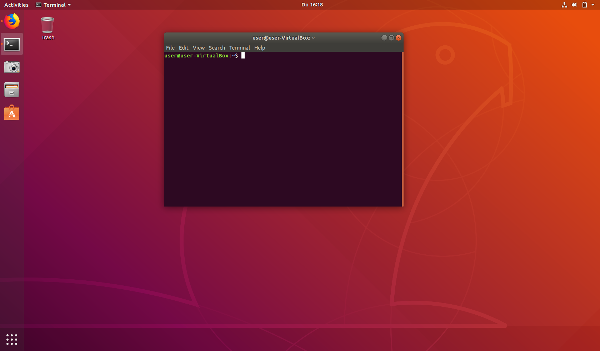
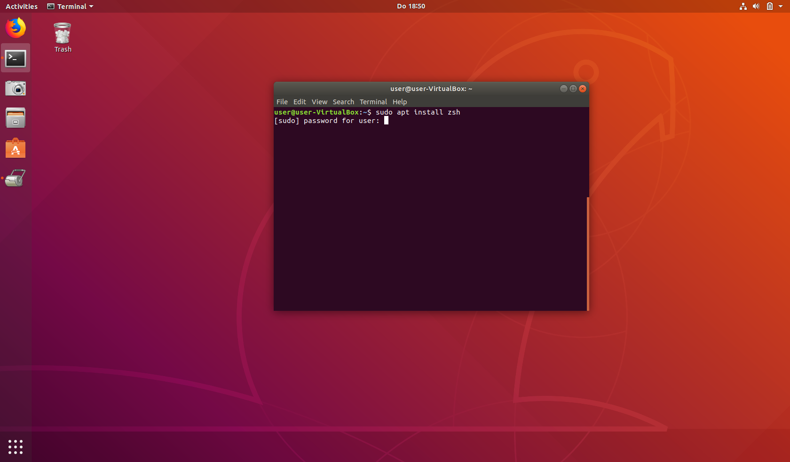
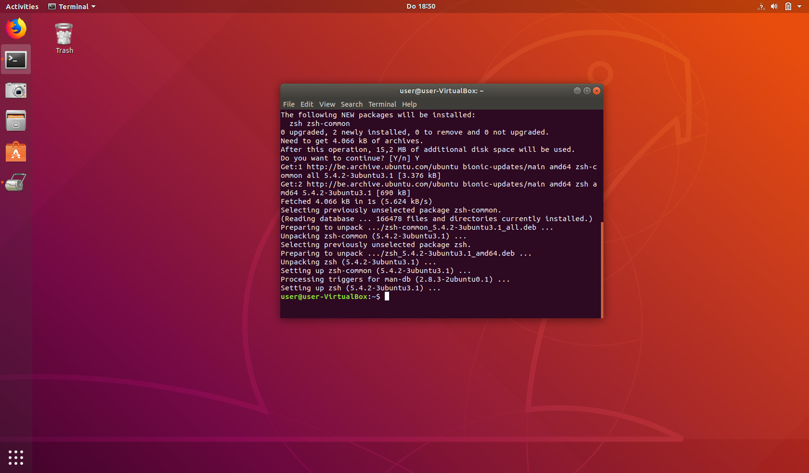
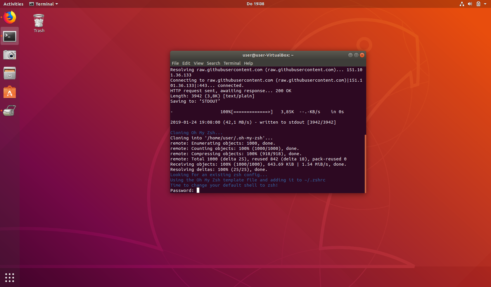
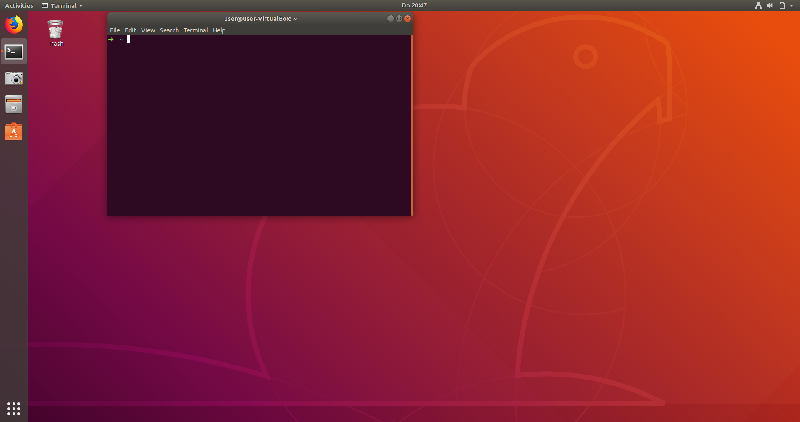
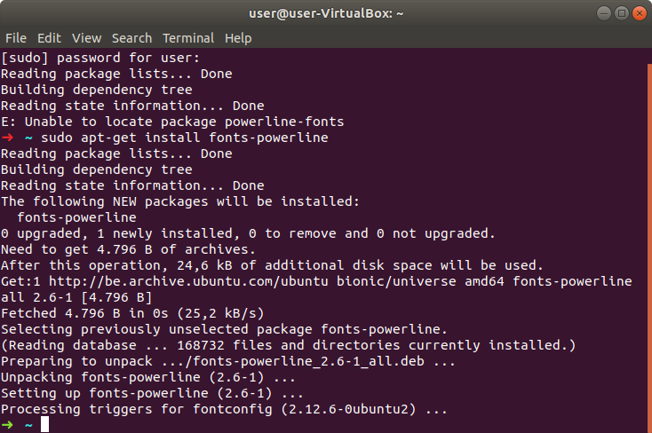
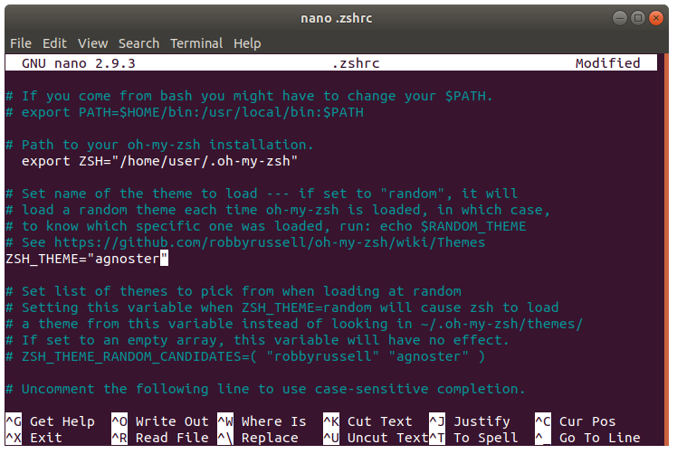
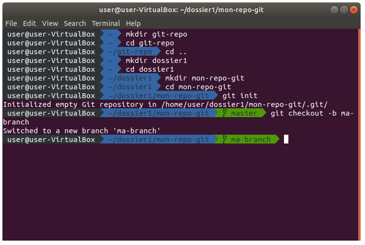
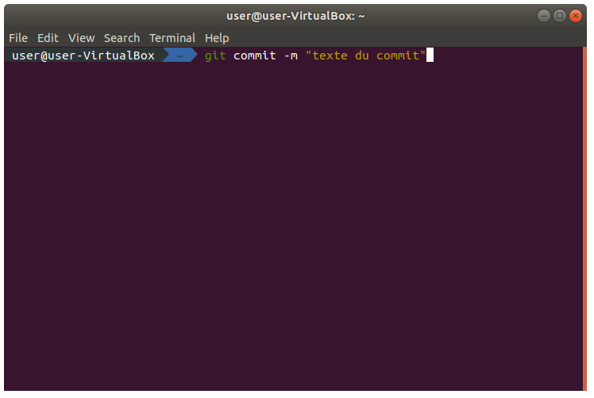
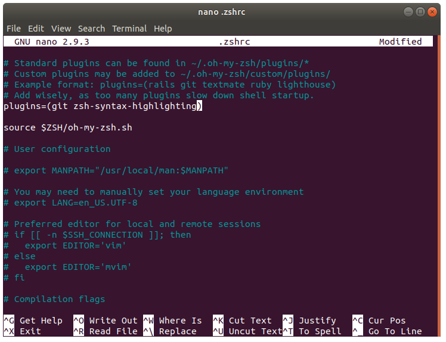

# Tuto Linux

# Le terminal de base
Sur `Linux` le terminal de base est mieux que sur `Windows` et `Mac`. Mais nous, **Becodiens**, nous voulons mieux! Car **nous méritons mieux**.

# Installer ZSH
Nous allons changer le shell *bash* de base pour passer à *ZSH* qui est plus puissant et personnalisable. Pour ce faire, Tapons la commande:
`suo install zsh`

Le terminal va nous demander notre *mot de passe*, puis vérifier que nous sommes sur de vouloir installer ZSH.

Parfait! ZSH est installé.

# Installer Ho My ZSH
Comme je viens de le dire, on en a jamais assez chez **Becode**. Alors, on va installer `Ho My ZSH` qui offre toujours plus de **fonctionnalités** et de **personalisation**!
Pour ce faire, rien de plus simple. On copie/colle cette ligne dans le *terminal*:

`sh -c "$(wget https://raw.githubusercontent.com/robbyrussell/oh-my-zsh/master/tools/install.sh -O -)"`
Ou, si ça ne fonctionne pas:
`sh -c "$(curl -fsSL https://raw.githubusercontent.com/robbyrussell/oh-my-zsh/master/tools/install.sh)"`

Le terminal va vous demander votre mot de passe puis vous proposer de changer votre vieux `bash shell` pour passer à `ZSH`. On dit oui!

On redémarre l'ordinateur et pouf, ZSH est mainteant le shell par défaut. *On remarque que l'interface du terminal à changer.*

`Ho My ZSH`est maintenant installé. *clap clap clap*

#Installer Powerline Fonts
Pour que le thème que nous allons installé fonctionne il nous faut installer des polices *spéciales*.
Alors allons-y! Installé un grand nombre de polices peut être une opération très fastidieuse... Heureusement Powerline Font nous a préparé une commande toute faite pour tout faire d'un coup! Sympa non?

`sudo apt-get install fonts-powerline`

# Changer de thème
Ensuite, on va changer le thème. *Non mais parceque les écritures vertes et bleu sur fond noir ok ça fait matric dans la pratique c'est pas ce qui a de plus claire quoi...*
Pour ça, on va utiliser `nano`. Tout le monde s'en souviens? C'est l'éditeur de texte tout moche. On va donc s'en servire pour éditer le ficher de configuration de `zsh`.

`nano .zshrc`

Une fois dans le fichier, on va changer le thème. Il suffit de changer la valeur de `ZSH_THEME="Robbyrussel"` pour y mettre: 

`ZSH_THEME="agnoster"`

*`Ctrl + X` puis `y` puis `entrer` pour sauvegarder.*

On quite le terminal, on le relance et la magie opère. On y est presque!

# Un petit plugin pour coloriser les commandes
Pour terminer en beauté nous allons installer un plugin qui colorise nos commandes.
Un petit exemple:

Sympa non?

## 1. Clonner le repo du plugin et l'installer dans ZSH. Le tout en une commande!
`git clone https://github.com/zsh-users/zsh-syntax-highlighting.git ${ZSH_CUSTOM:-~/.oh-my-zsh/custom}/plugins/zsh-syntax-highlighting`

## 2. Activer le plugin
Pour ce faire, on va dans le dossier de configuration `~/.zshrc` grâce à la commande: 
`nano ~/.zshrc`
Ensuite, on l'ajoute à la liste des plugins. 
`zsh-syntax-highlighting`
On le redémarre et le tour est joué!

Et voilà. On a mainteant un super terminal très clair grâce à `ZSH` et `Ho My ZSH` !

Si vous avez des questions n'hésitez pas à me contacter! :)
