# Customiser son super terminal!

Je me suis inspiré de [ce guide](https://medium.freecodecamp.org/jazz-up-your-zsh-terminal-in-seven-steps-a-visual-guide-e81a8fd59a38) extrèmement bien fait en anglais.

## Le résultat attendu:

Le but est d'obtenir un affichage **plus clair** du *dossier* dans lequel nous sommes mais également de voir constament dans quel *branch* de git nous sommes.
Mais ce n'est pas le seul objectif. Soyons honnête, il est plus agréable de travailler sur un terminale coloré et clair que sur une fenêtre noire et blanche toute moche! Vous verrez, on se sent comme un vrais Hacker avec un terminal comme ça! 😝

## Guide d'installation

### 1. installer ITerm2
Nous allons remplacer notre vieux terminal tout moisi (mais bien meilleur que celui de windows quand même hein 😉) par un super terminal ultra performant! Pour cela, nous allons nous rendre sur le site d'[Iterm 2](https://www.iterm2.com/). cliquer sur download, enregister le fichier .zip et l'ouvrire.

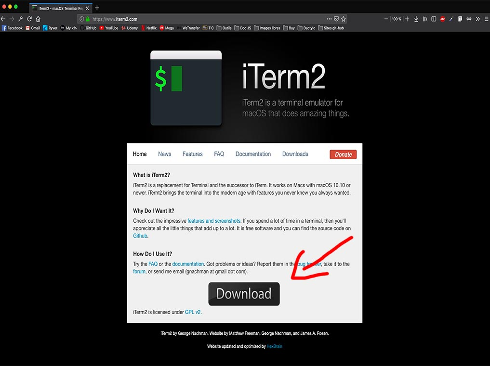

Nous nous retrouvons avec l'appliquation super! Sauf que normalement elle se trouve dans nos téléchargement et ce n'est pas vraiment ce qu'on veut... Nous allons donc la déplacer dans le dossier application.

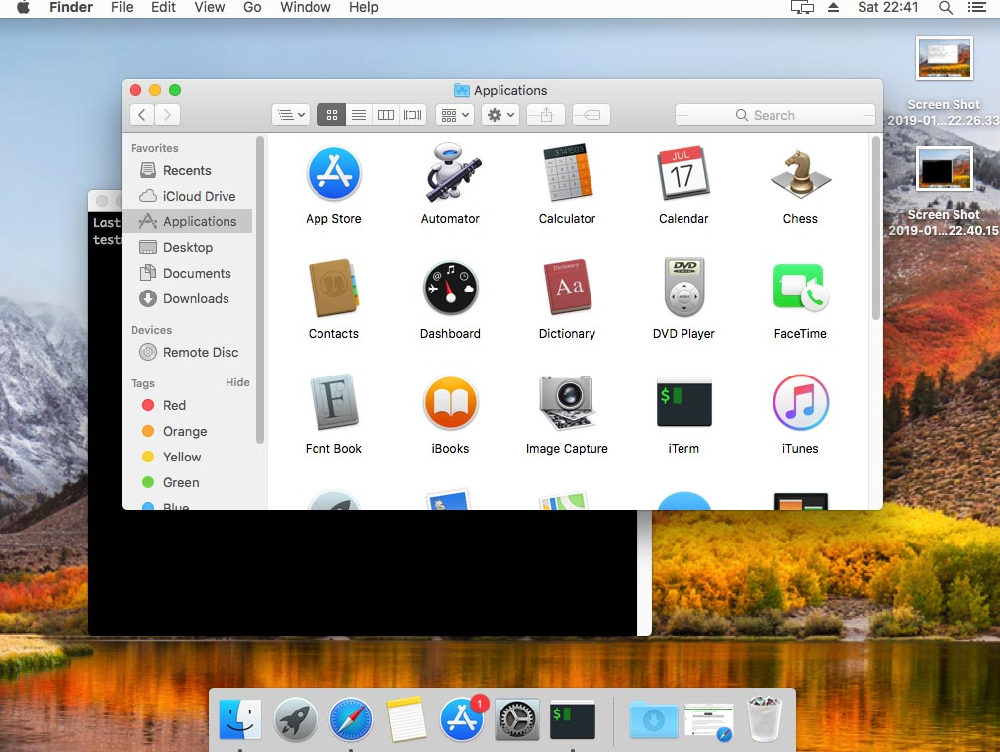

Ouvrons **ITerm 2** pour voir ce que ça donne:

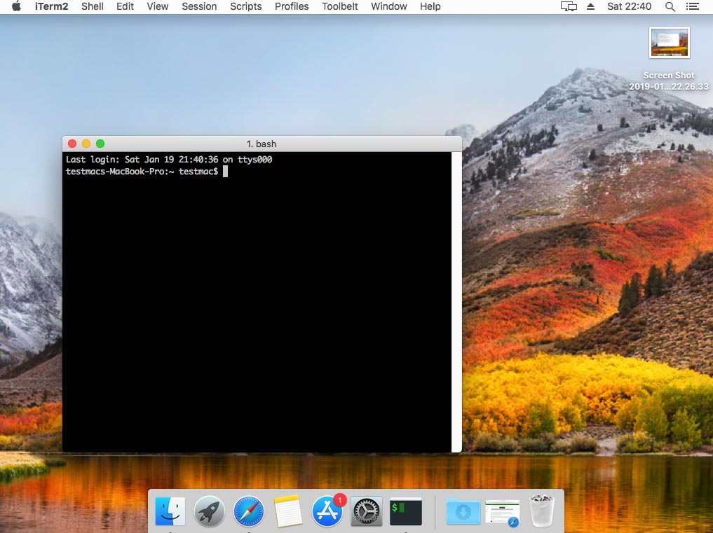
Pas terrible hein... Et bien customisons notre nouveau super terminal!

### 2. Installer HomeBrew
Nous allons installer HomeBrew. Mais qu'est ce que HomeBrew me demanderez-vous? (et si pas, bah vous êtes vraiment pas curieux!)
Et bien c'est un gestionnaire de paquet. C'est à dire que ça va vous permettre d'installer des programmes directement depuis votre terminale.
Je vais pas m'étendre plus que ça sur les gestionnaire de paquets, si ça vous interesse je vous recommande cette page [Wikipédia](https://fr.wikipedia.org/wiki/Gestionnaire_de_paquets).

Asser discuter, tapons la commande qui permet de l'installer directement depuis le terminal *(nous allons désormais remplacer le terminal par ITerm2, donc quand je parlerai de terminal ça voudra dire Iterm2)* :

`ruby -e "$(curl -fsSL https://raw.githubusercontent.com/Homebrew/install/master/install)"`

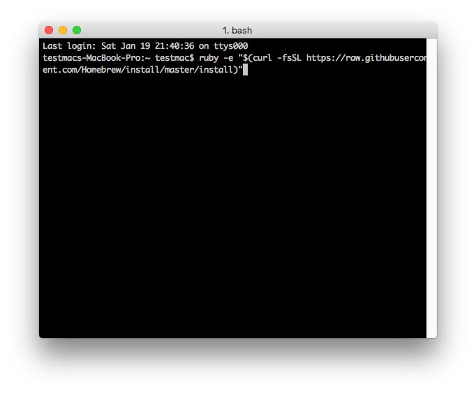

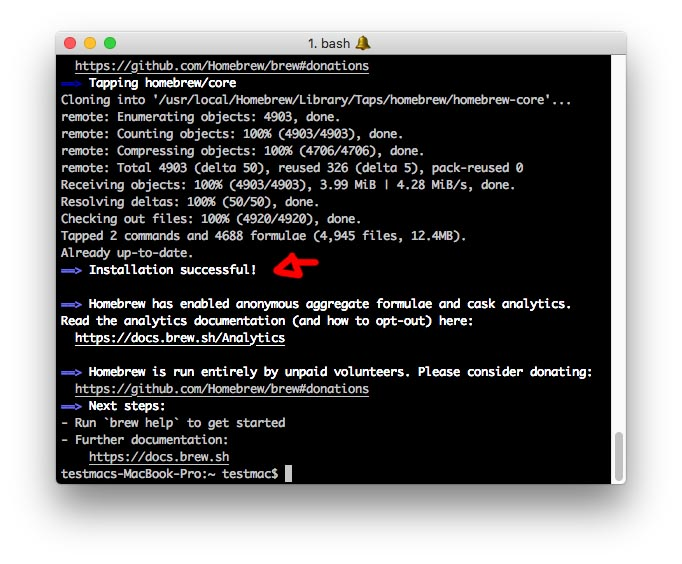

*Il est possible que vous ayez une erreur Xcode, dans ce cas, installez Xcode grâce à cette commande: `xcode-select --install`.
Super, Homebrew est installer!

### 3. Installer ZSH
Nous allons maintenant installer ZSH. Non non, ce n'est pas un groupe de rap à la mode. C'est un shell Unix. En gros c'est une super amélioration du terminal trop pratique! Pour les curieux, voir [cette page wikipédia](https://fr.wikipedia.org/wiki/Z_Shell).
A vos claviers, prêt ? Installez!

`brew install zsh`

Une fois l'installation démarrée, on vous demandera de `press RETURN` donc d'appuier sur entrer. 

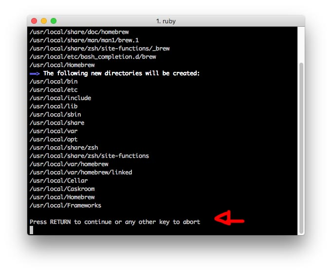

Une fois cette tâche d'un haute complexité accomplie avec succès, entrez votre mot de passe de session.

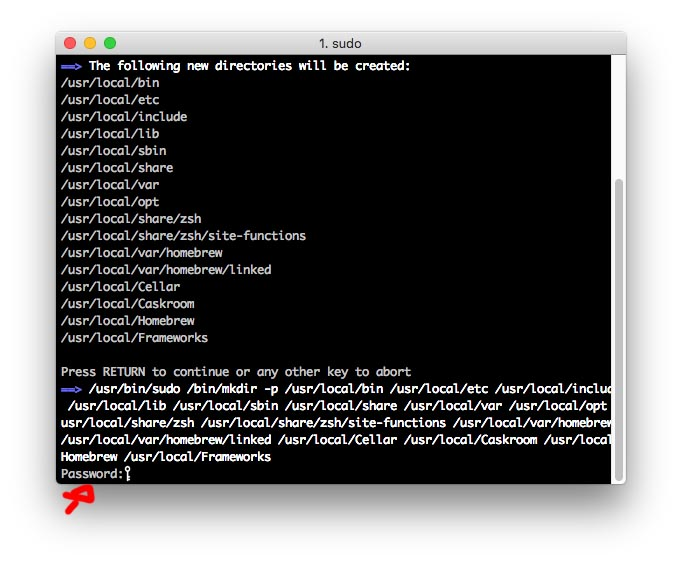

Félicitation! Vous avez installé ZSH avec brio.

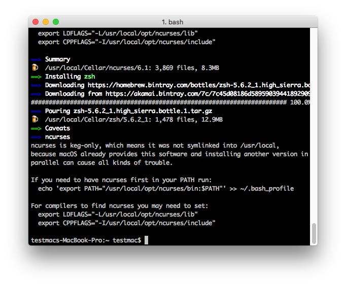

Maintenant qu'il est installé, activons le avec la commande :
`chsh -s /usr/local/bin/zsh`
Puis, redémarrer l'ordinateur. Mais n'oubliez pas de revenir... Enfin ce serait sympa quoi...

L'activation devrait avoir fonctionné. Pour le vérifier, tapons `echo $0`
Si on obtient zsh en réponse, c'est que tout à bien fonctionné. 

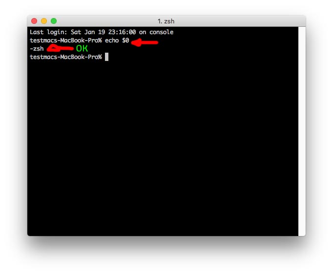

Si on obtient `bash` c'est que ça n'a pas marché. Dans ce cas, tapez : `chsh -s /bin/zsh` ça devrait régler le problème. Redémarez votre machine et tapez `echo $0` cette fois ci, le terminal devrait vous retourner `zsh` .

Yeah! une étape de plus vers votre super terminal de hacker!

### 4. Installer "Ho My ZSH"
Encore? Bah oui je vous l'ai dis, ce n'est pas seulement un bon terminal c'est un super terminal! Ho My ZSH est un plugin pour dopper zsh.

Cette fois ci, c'est super simple, on tape la commande d'installation et le terminal s'occupe du reste.
`sh -c "$(curl -fsSL https://raw.github.com/robbyrussell/oh-my-zsh/master/tools/install.sh)"`

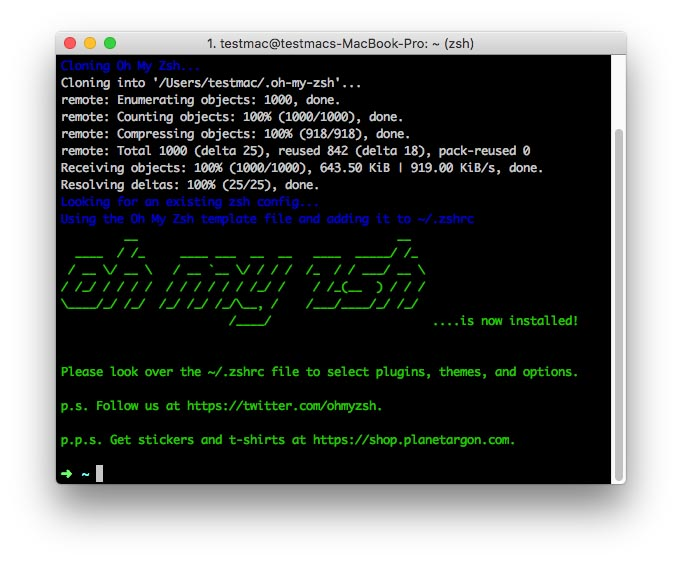

On ferme Iterm2 **(complètement)** et on le relance.

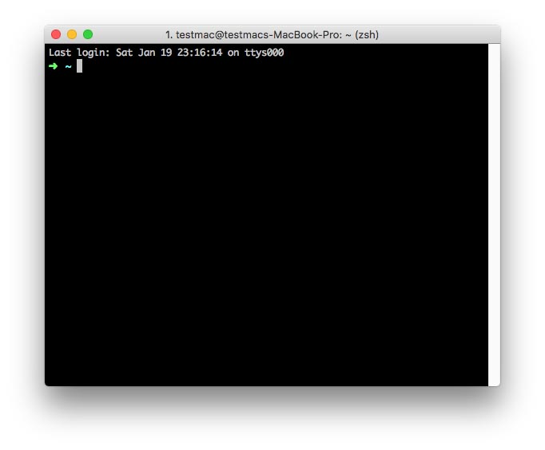

>A ce stade votre ITerm2 devrait ressembler à ça.

**Voilà. Ho My ZSH est installé.**

### 5. Changer le thème et installer les polices
Le plus gros est fait! Nous allons maitenant installer un thème et les polices qui vont avec.
Il existe pleins de thèmes pour Ho My ZSH. Je vais vous en présenter un en particulier mais si vous voulez avoir un aperçus de ce qui existe [allez jeter un oeil par ici](https://github.com/robbyrussell/oh-my-zsh/wiki/Themes).

#### Première étape: installer et changer la police
##### 1. **Installer les polices Powerline fonts**
Pour ce faire, nous allons cloner un [repo](https://github.com/powerline/fonts)) qui contient des polices spéciales nommées **Powerline**. Puis nous allons les rentrer dans le repo et enfin les installer.

```
git clone https://github.com/powerline/fonts.git
cd fonts
./install.sh
```

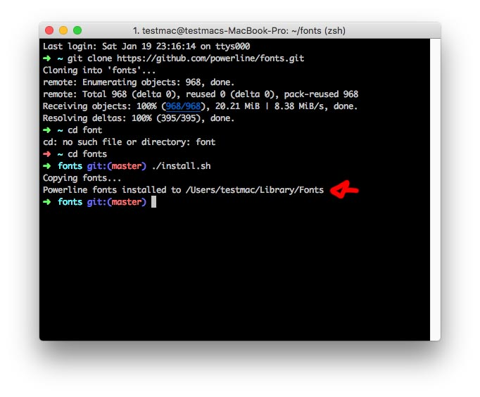

##### 2. **Changer la police**
Ces polices sont faites pour afficher de jolies flèches dans le terminale. Alors il y en a pleins, on va en choisire une et pour ce faire, on va aller dans Iterm2 puis dans le menu `ITerm2 > Preferences`  puis dans l'onglet `Profiles > Text` puis cliquer sur `Change Font`.

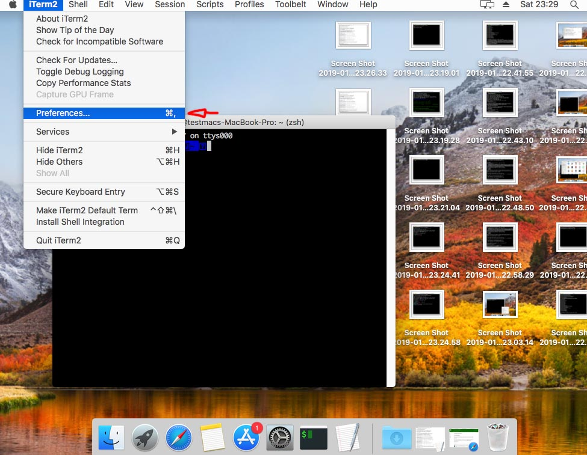
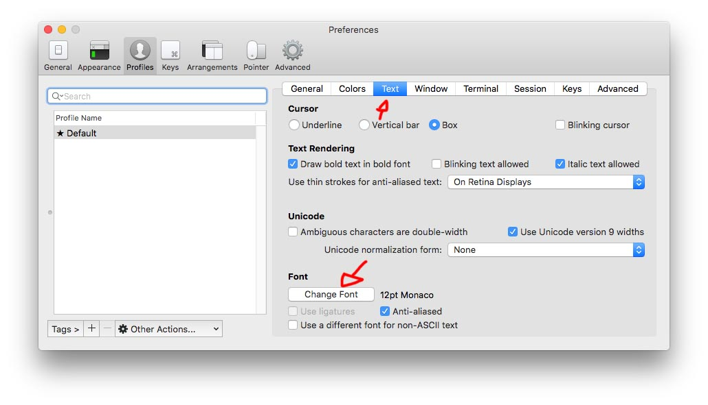

Vous avez ensuite le choix entre une multitude de polices mais ne choississez qu'une police où il est précisé `for Powerline` sinon vous vous retrouverez avec des points d'interogations tout moches dans votre super terminal (ce serait dommage non?). Je vous consseille fortement `Melso LG L DZ for powerline`

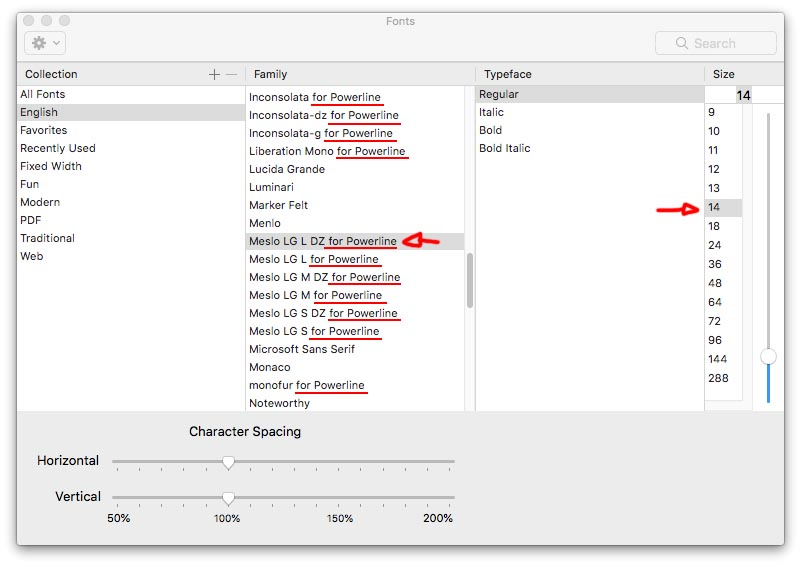

#### Deuxième étape changer le thème et le background de ITerm2

##### 1. Changer le thème
Pour changer le thème, on va ouvrire le fichier de configuration de ZSH. Pour ce faire :
`open ~/.zshrc`

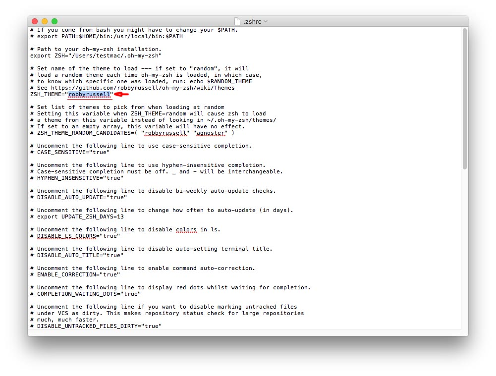

Puis, on change `ZSH_THEME=" "` avec la valeur `Agnoster`

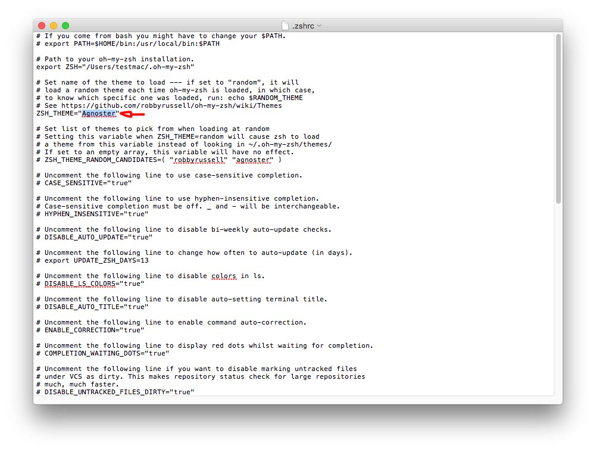

On relancer **complètement** ITerm2 et voilà ce qu'on obtient:

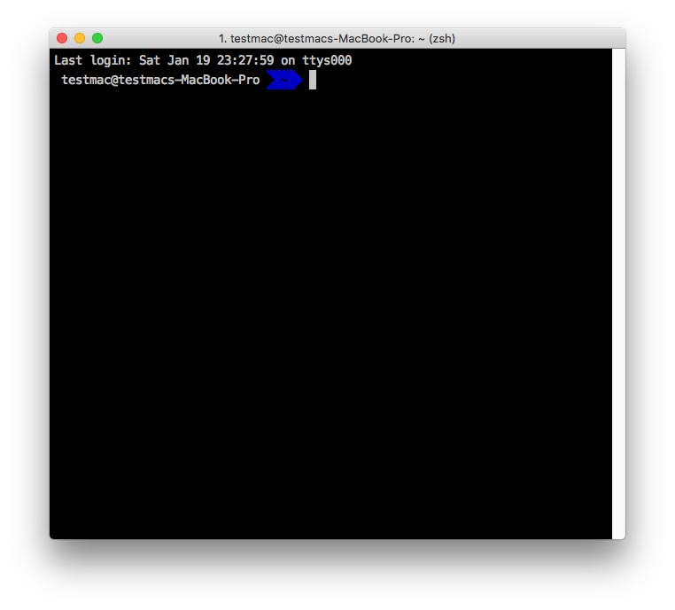

Ça prend forme!

##### 2. Changer le background
Le noir en arrière plan je sais pas vous mais moi ça me plait pas trop... Changons ça!
On retourne dans `Iterm2 > preferences` puis on va dans l'onglet `profiles > colors` et on double click sur `background` pour changer la couleur.

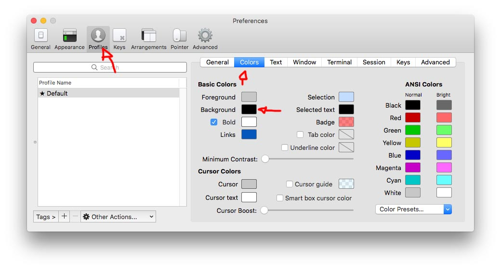

On choisi ce la couleur qui nous plait (je vous conseille un joli `gray 40%`)
Et voilà le travaille:

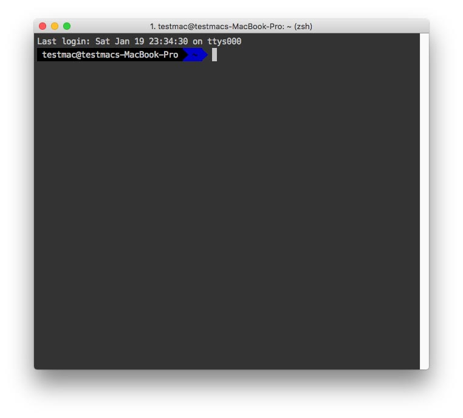

### Donner du style à ITerm2 grâce aux colors schemes!
On va rendre tout ça encore plus beau grâce aux colors schemes, il en existe de centaines tous diffénts, alors testez les et trouver celui qui est fait pour vous!

#### 1. Télécharger les colors schemes
On se rend sur [ce repos](https://github.com/mbadolato/iTerm2-Color-Schemes) et on le télécharge en ZIP.

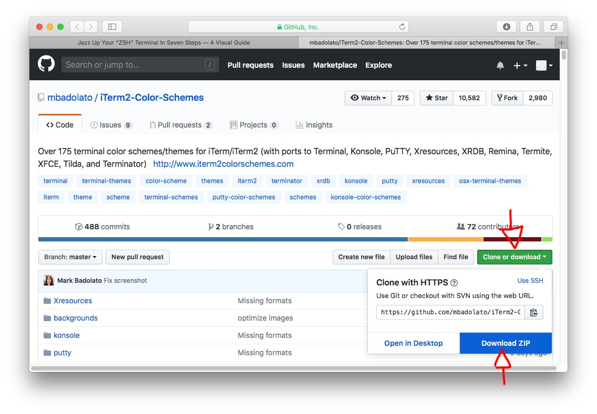

Les colors schemes se trouvent dans le dossier *"Schemes"*  il y en a pleins et ils se finissent tous par l'extention `.itermcolors`.

#### 2. Importer les colors schemes
On va les importer directement dans ITerm2, pour ce faire on va dans `ITerm2 > Preferences > Profiles > Colors > Color Presets > Import`

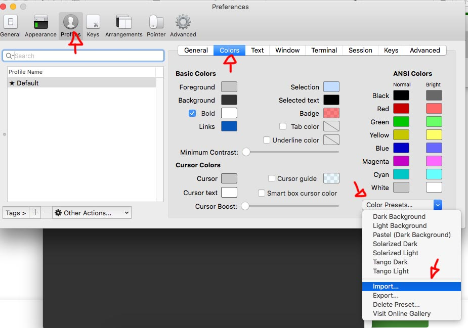

On va ensuite dans le dossier `Téléchargement > ITerm2-.... (le dossier qu'on vient de télécharger) > schemes` On séléctionne tout grâce à command + a et on clique sur import.

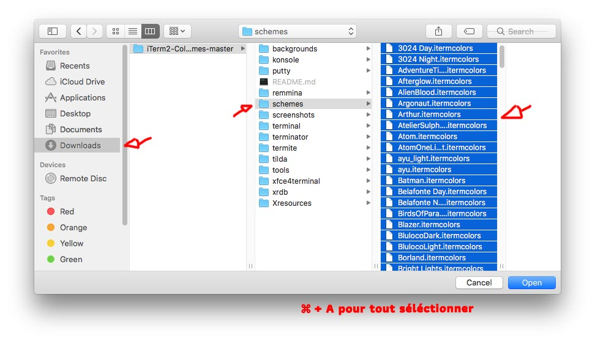

#### 3. Séléctionner son color scheme
Ensuite il suffit de séléctionner `Argonaut` *(qui est juste magnigique) ou un autre qui vous plaira et le tour est joué! Le preset Batman est très joli aussi 😉.

*Argonaut:*

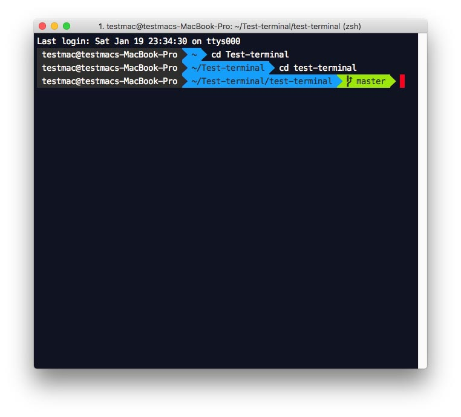

*Batman:*

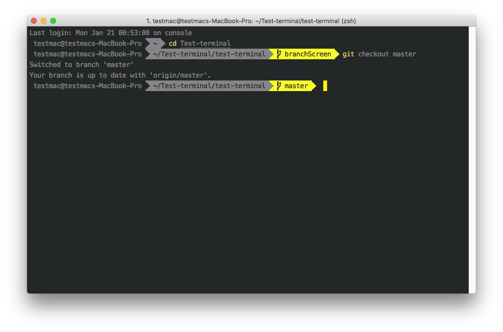

> La coloration des commandes est gerée par un plugin que nous installerons après.

Et voilà! Vous avez un super terminal surpuissant!

### Un petit plugin pour coloriser les commandes
Pour terminer en beauté nous allons installer un plugin qui colorise nos commandes.
Un petit exemple:

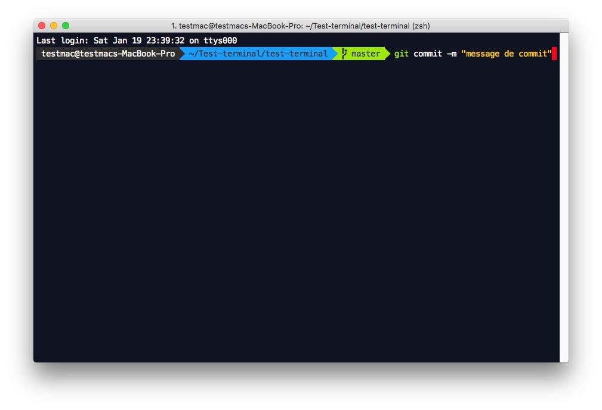

Sympa non?

##### 1. Clonner le repo du plugin et l'installer dans ZSH. Le tout en une commande!
`git clone https://github.com/zsh-users/zsh-syntax-highlighting.git ${ZSH_CUSTOM:-~/.oh-my-zsh/custom}/plugins/zsh-syntax-highlighting`

##### 2. Activer le plugin
Pour ce faire, on va dans le dossier de configuration `~/.zshrc` grâce à la commande `open ~/.zshrc`
Ensuite, on l'ajoute à la liste des plugins. On le redémarre et le tour est joué!

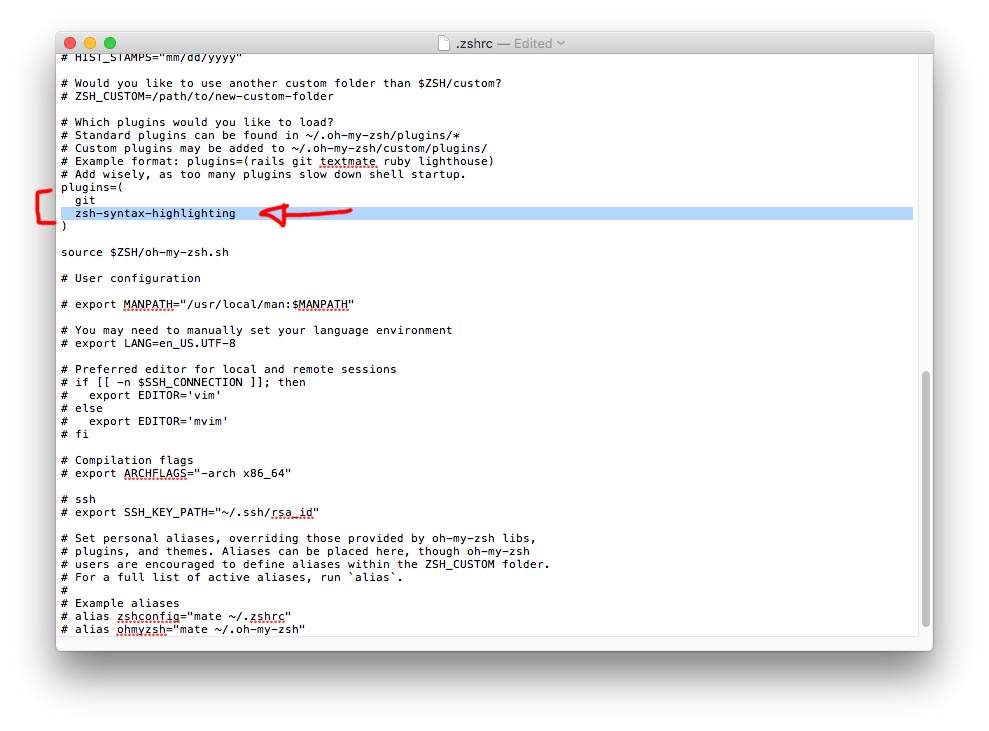

Et voilà. On a mainteant un super terminal très clair grâce à `ITerm2`, `ZSH`, `Ho My ZSH` et `ITerm2-colors-schemes` !

Si vous avez des questions n'hésitez pas à me contacter! :)


