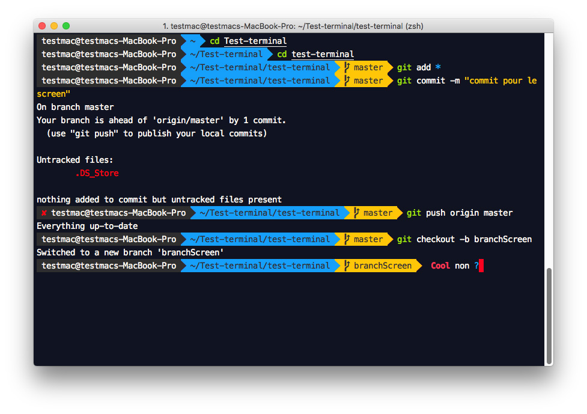

# Cusomiser son terminal
En tant que développer on passe beaucoup de temps dans son terminal. Il est donc important (surtout quans on apprend à s'en servir) d'avoir un terminal clair dans lequel on peut tout de suite repérer dans quelle dossier on se trouve, dans quelle branche git,...

Personne n'a envie de taper en core moins d'apprendre à se servir d'un terminal comme ça:

Alors que dans celui-là... Ça donne déjà plus envie je trouve...

